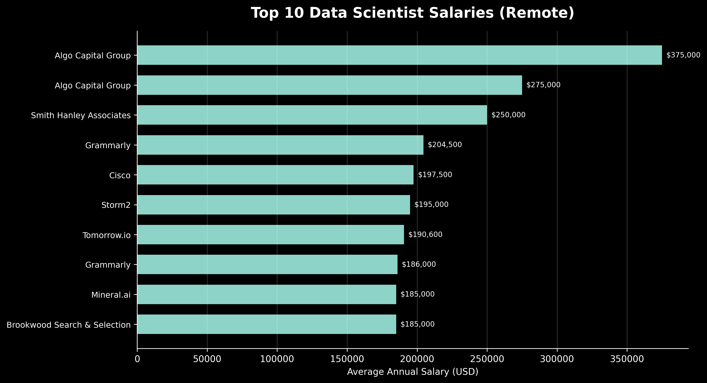

# Introduction
**Top skills for Data Scientist roles based on salary and demand of jobs.**

SQL queries? Check them out here [project_sql_folder](/project_sql/)
# Background
blah blah

1. What are the top-paying Data Scientist roles?
2. What are the skills required for top-paying Data Scientist roles?
3. What are the top demanded skills for Data Scientist roles?
4. What are the Top paying skills for Data Scientist jobs?
5. What are the most optimal skills to learn? (Pay and Demand)
# Tools used
- **SQL**: 
- **PostgresQL**: 
- **Git & GitHub**: 
# Analysis
blah blah
### 1. Top Paying Data Scientist Jobs
blah blah

```sql
SELECT
    job_id,
    job_title,
    job_schedule_type,
    salary_year_avg,
    job_posted_date,
    company_dim.name AS company_name
FROM
    job_postings_fact
LEFT JOIN company_dim ON job_postings_fact.company_id = company_dim.company_id

WHERE job_title = 'Data Analyst' AND 
      job_location = 'Anywhere' AND
      job_work_from_home = TRUE AND
      salary_year_avg IS NOT NULL
ORDER BY
      salary_year_avg DESC
LIMIT 10
```
blah blah


*chatgpt generated it*

### 2. Skills Required for top-paying Data Scientist roles
blah blah

```sql
WITH top_paying_jobs AS(
SELECT
    job_id,
    job_title,
    salary_year_avg,
    company_dim.name AS company_name
FROM
    job_postings_fact
LEFT JOIN company_dim ON job_postings_fact.company_id = company_dim.company_id

WHERE job_title = 'Data Scientist' AND 
      job_location = 'Anywhere' AND
      salary_year_avg IS NOT NULL
ORDER BY
      salary_year_avg DESC
LIMIT 10
)

SELECT
      top_paying_jobs.*,
      skills
FROM top_paying_jobs
INNER JOIN skills_job_dim AS skills_job ON top_paying_jobs.job_id = skills_job.job_id
INNER JOIN skills_dim ON skills_job.skill_id = skills_dim.skill_id

ORDER BY  top_paying_jobs.salary_year_avg DESC
```

### 3. Most Demanded Skills
blah blah
```sql
    SELECT
        skills,
        COUNT(skills_job_dim.job_id) AS demand_count
    FROM job_postings_fact
    INNER JOIN skills_job_dim ON job_postings_fact.job_id = skills_job_dim.job_id
    INNER jOIN skills_dim ON skills_job_dim.skill_id = skills_dim.skill_id
    WHERE
        job_title_short = 'Data Scientist'
        AND job_work_from_home = TRUE
    GROUP BY
        skills
    ORDER BY 
        demand_count DESC
    LIMIT 5
```

### 4. Skills that Pay the Most
blah blah
```sql
SELECT
   skills,
   ROUND(AVG(salary_year_avg),0) AS avg_salary
FROM job_postings_fact AS job_postings
INNER JOIN skills_job_dim ON job_postings.job_id = skills_job_dim.job_id
INNER JOIN skills_dim ON skills_job_dim.skill_id = skills_dim.skill_id

WHERE 
   job_title_short = 'Data Scientist'
   AND salary_year_avg IS NOT NULL 
   AND job_work_from_home = TRUE
   

GROUP BY skills
ORDER BY avg_salary DESC
LIMIT 25
```

### 5. Most optimal skills for Data Scientists
blah
```sql
SELECT
    skills_dim.skill_id,
    skills_dim.skills,
    COUNT(skills_job_dim.job_id) AS demand_count,
     ROUND(AVG(salary_year_avg), 0) AS avg_salary
FROM job_postings_fact
    INNER JOIN skills_job_dim ON job_postings_fact.job_id = skills_job_dim.job_id
    INNER jOIN skills_dim ON skills_job_dim.skill_id = skills_dim.skill_id
WHERE
    job_title_short = 'Data Scientist'
    AND job_country = 'United States'
    AND salary_year_avg IS NOT NULL 
    AND job_work_from_home = TRUE
GROUP BY
    skills_dim.skill_id
HAVING COUNT(skills_job_dim.job_id) > 10
ORDER BY 
   avg_salary DESC,
   demand_count DESC
LIMIT 25
```

# What I learned
hello test 123
# Conclusions
