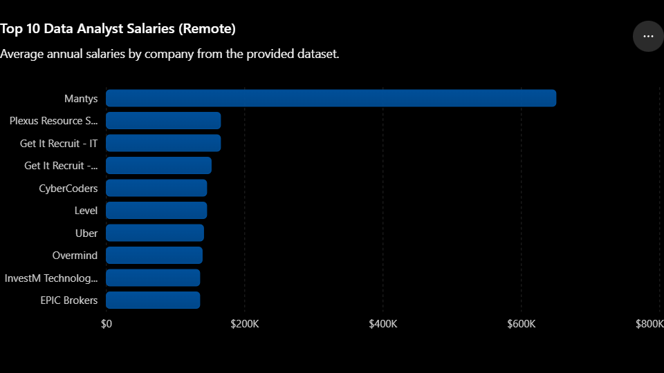

# Introduction
Top skills for Data Scientist roles based on salary and demand of jobs.

SQL queries? Check them out here [project_sql_folder](/project_sql/)
# Background
blah blah

1. What are the top-paying Data Analyst roles?
2. What are the top-paying skills for Data Analyst roles?
3. What are the top demanded skills for Data Analyst roles?
4. 
5.
# Tools used
- **SQL**: 
- **PostgresQL**: 
- **Git & GitHub**: 
# Analysis
blah blah
### 1. Top Paying Data Analyst Jobs
blah blah

```sql
SELECT
    job_id,
    job_title,
    job_schedule_type,
    salary_year_avg,
    job_posted_date,
    company_dim.name AS company_name
FROM
    job_postings_fact
LEFT JOIN company_dim ON job_postings_fact.company_id = company_dim.company_id

WHERE job_title = 'Data Analyst' AND 
      job_location = 'Anywhere' AND
      job_work_from_home = TRUE AND
      salary_year_avg IS NOT NULL
ORDER BY
      salary_year_avg DESC
LIMIT 10
```
blah blah


*chatgpt generated it*

# What I learned
hello test 123
# Conclusions
